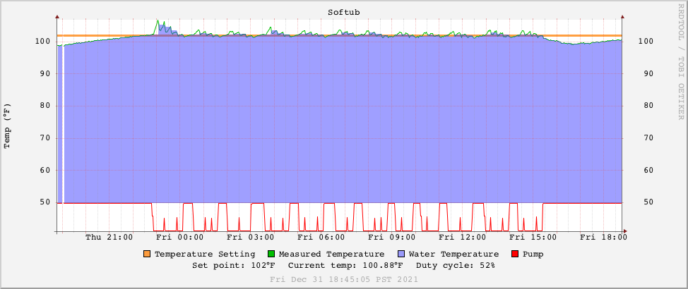

# Graphing scripts

These are the scripts I use to build graphs of the statistics reported by the hot tub controller over time. 

They're part of a larger set of scripts I use to graph various information about my local network on a server running [MRTG](https://oss.oetiker.ch/mrtg/)/[RRD](https://oss.oetiker.ch/rrdtool/index.en.html). 

They're set up for my specific configuration, so don't expect them to work out of the box, but they shouldn't be hard to adapt to any machine that has RRD installed. 

I'm providing them as-is for people to use as a starting point if they so choose. 

The scripts will generate graphs something like this: 

 
