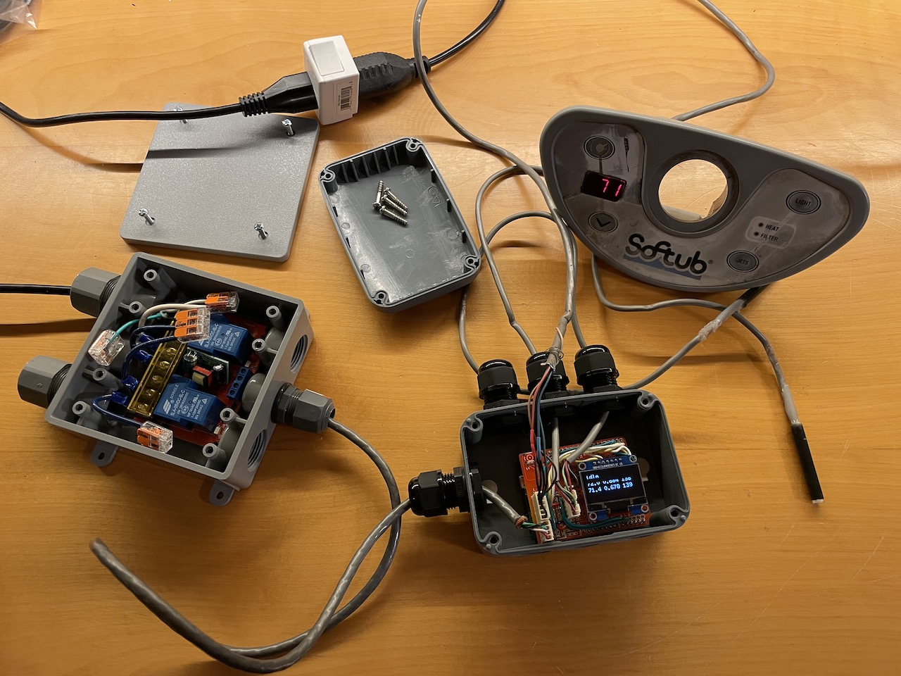
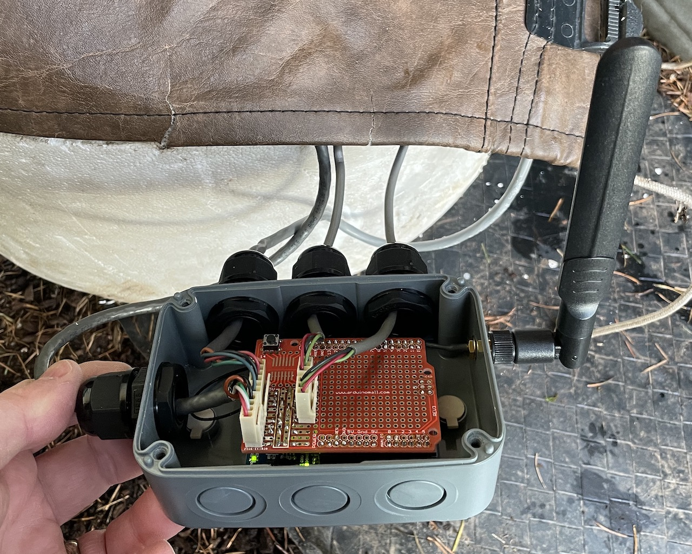
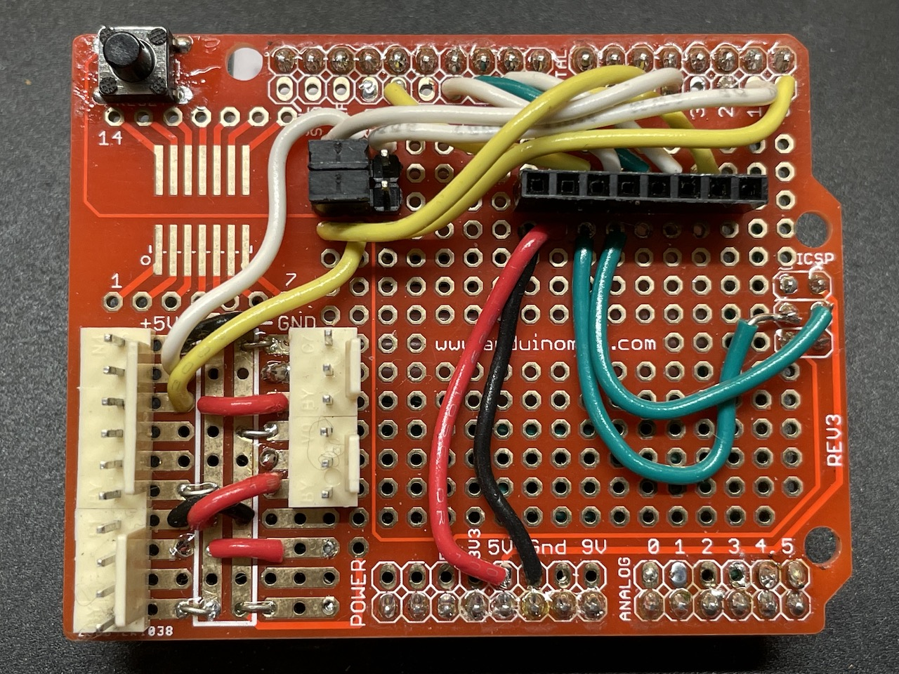
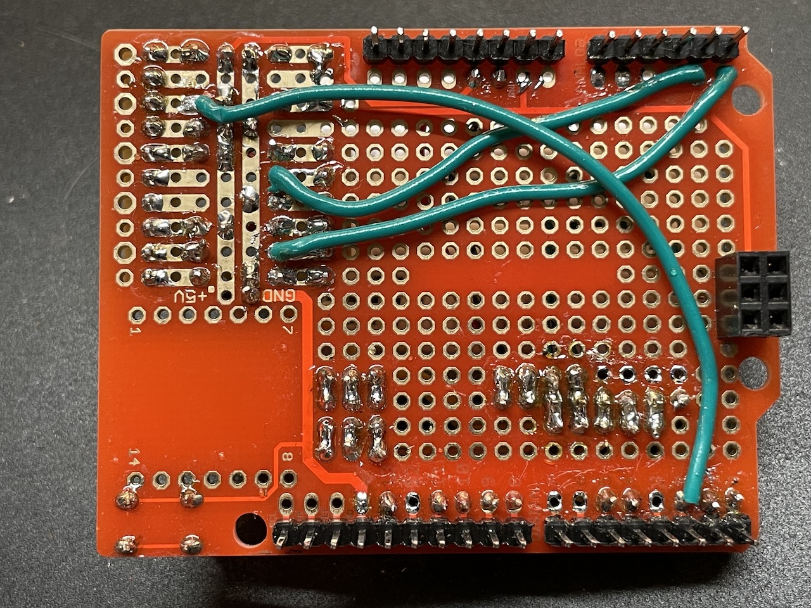

# Hardware info

My initial build used a [Leonardo clone](https://www.amazon.com/dp/B0786LJQ8K), and one of [these combined relay and 5v power supplies](https://www.amazon.com/dp/B077W1NVLM).

I'm using a [prototyping shield](https://www.amazon.com/dp/B00Q9YB7PI) to distribute power and mount plugs for the connections. The original plugs on the Softub board are Molex KK 254 series. They're compatible with plain 2.54mm header pins, but if you want to have proper locking connectors that fit the original cables, [this kit](https://www.amazon.com/dp/B01M69TKAM) has solderable board-side male connectors that are a match.

Later in the project, I added support for a couple of ESP32-based boards: the [WeMos D1 R32](https://www.amazon.com/gp/product/B07WFZCBH8) (which appears to be the same hardware as the [DOIT ESPduino32](https://www.amazon.com/dp/B0775WFN9P)), and the [ArduCAM IoTai](https://www.amazon.com/gp/product/B07W8SMFTK). I've included board definitions and pins file for these in the repository, as the [esp32doit-espduino board definition](https://docs.platformio.org/en/latest/boards/espressif32/esp32doit-espduino.html) built into PlatformIO has a couple of minor issues (mostly that the SPI library expects SCK/MISO/MOSI/SS to be defined, which breaks the build), and I don't see one matching the ArduCAM IoTai at all.

The relay/power supply unit I started with doesn't seem to have quite enough power for the ESP32 when WiFi is enabled -- the board is prone to brown out and reset (which doesn't happen when it's powered via USB). I've switched to a [different power supply](https://www.amazon.com/gp/product/B07V5XP92F) and a separate [single relay module](https://www.amazon.com/gp/product/B07TWH7DZ1), which solve this issue.

Upon installing the board into the Softub pod (which is of course outside my house), I found that the PCB trace antenna was not sufficient for it to be able to connect to my house WiFi (even though one of my access points is just inside a wall from the tub, it seems that wall is exceptionally good at attenuating signals for some reason). I was able to fix this by resoldering the extremely tiny jumper on the ArduCAM IoTai board to enable the [external antenna connector](https://randomnerdtutorials.com/esp32-cam-connect-external-antenna/) (different board, but the jumpers look identical), and adding a [+8dB antenna and pigtail](https://www.amazon.com/dp/B082SHBWTK) mounted on the outside of the enclosure. 

Update: due to the location of my WiFI access points relative to the hot tub, I've had some trouble keeping a reliable connection using the antenna inside the pod. I've switched to an [external antenna with a 3m cable](https://www.amazon.com/dp/B07MG6ZXCD) that allows the antenna to be outside the pod, which helps a lot.

I have the relay and power supply mounted in a [junction box](https://www.homedepot.com/p/Commercial-Electric-1-2-in-Gray-2-Gang-7-Holes-Non-Metallic-Weatherproof-Box-WDB750PG/300851103) with a [blank cover](https://www.homedepot.com/p/Commercial-Electric-Gray-2-Gang-Non-Metallic-Weatherproof-Blank-Cover-WBC200PG/300851669) and some [cable](https://www.homedepot.com/p/3-4-in-Strain-Relief-Cord-Connector-LPCG757-1/100171642) [seals](https://www.homedepot.com/p/Arlington-Industries-1-2-in-Low-Profile-Strain-Relief-Cord-Connector-LPCG507-1/308920052) (all sourced from my local Home Depot) so that all AC power is isolated from the arduino. 

The Arduino/ESP32 board is mounted in a [separate enclosure with its own cable seals](https://www.amazon.com/dp/B08M3R71ZD).

## Shield layout

This is a picture of the original configuration on my workbench, with the Leonardo board, the [combined relay/power supply unit](https://www.amazon.com/dp/B077W1NVLM), and my debugging shield (which has connections for an [OLED display](https://www.amazon.com/gp/product/B01N1LZT8L)).

Here's a shot of the final configuration, ready to be put back in the pod. This is another shield I built that doesn't have the OLED display connections (since it's going to be buried inside the Softub pod there's no need), and has the [Arducam IoTai board](https://www.amazon.com/gp/product/B07W8SMFTK) and [external antenna](https://www.amazon.com/dp/B082SHBWTK) mounted. The external antenna just sticks up in the empty space inside the pod.

I don't have great pictures of the wiring on the final shield, and I don't really feel like pulling it out of the pod right now.

The debugging shield (pictured below) is a bit of a mess, since I've reworked it repeatedly as the project evolved. It has a whole extra set of wires for the OLED display's SPI connection, and it also has jumpers so that I can switch it between the Leonardo's hardware serial pins (D0/D1) and different ones I use on the ESP32 boards (D4/D5, since on the ESP boards I have D0/D1 are hardwired to the USB-Serial chip, which interferes with the panel connection).

The hardware SPI pins vary between the two ESP32 boards I have (The WeMos board doesn't have an ICSP connector _at all_ and has MOSI/SCK in the same place as an UNO on D11/D13, whereas the IoTai and the Leonardo both have MOSI/SCK _only_ on the ICSP connector), so I've got a couple different pins connected to the MOSI/SCK pins on the display connector. This works fine as long as each board sets the other pins that are connected to the hardware SPI pins to INPUT mode (see the QUIESCE_PINS macro defined in the board-specific sections of the source).

The prototyping boards I used have a little section with +5v/ground rails and 3-pin protoboard-style strips in one corner, which turns out to be perfect for distributing power/ground to the connector plugs. The 4-pin plug at the very lower left corner is not original to the Softub -- it's the connection between the two enclosures that brings +5v/ground from the power supply in the AC enclosure to the logic board, and the control signal for the relay back to the AC enclosure. I found an old multi-conductor cable in my parts bin and crimped on a 4-pin connector from the Molex KK kit I bought so it matches the others.

