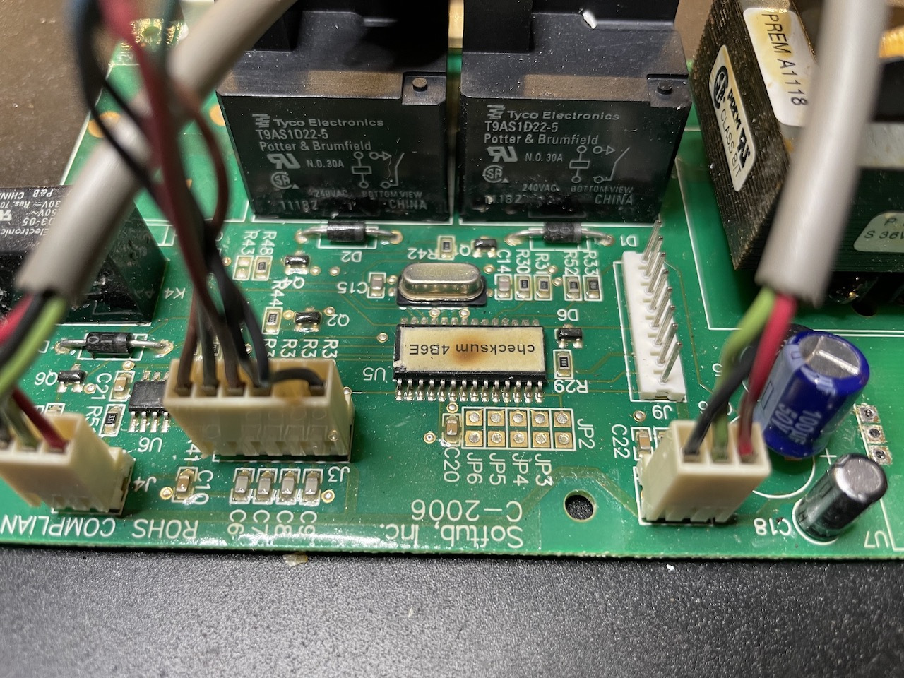
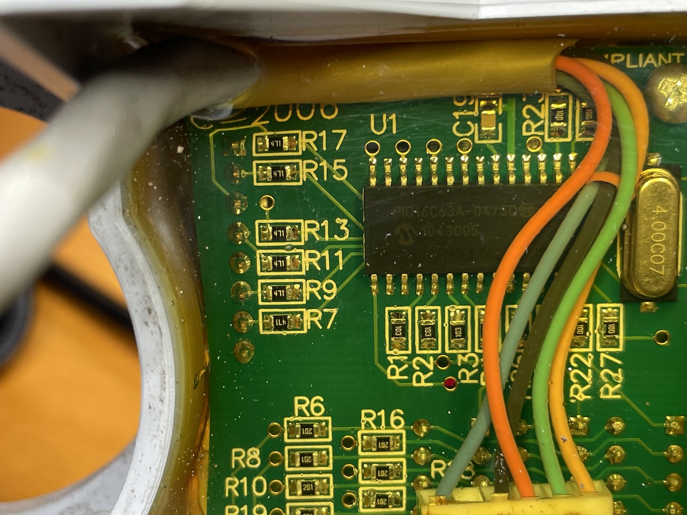
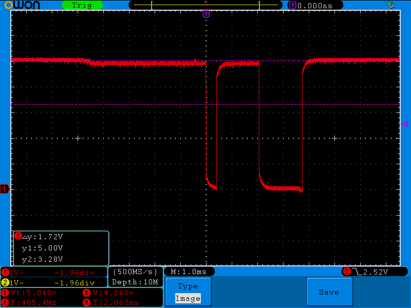
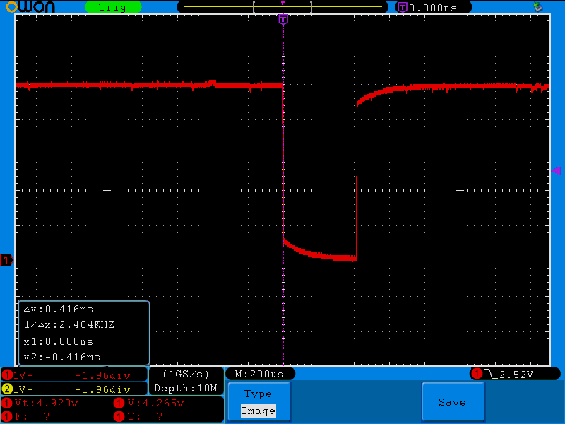
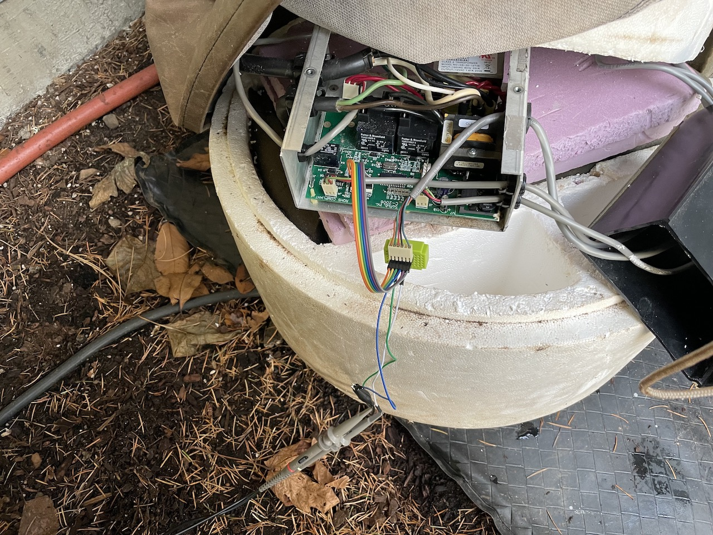
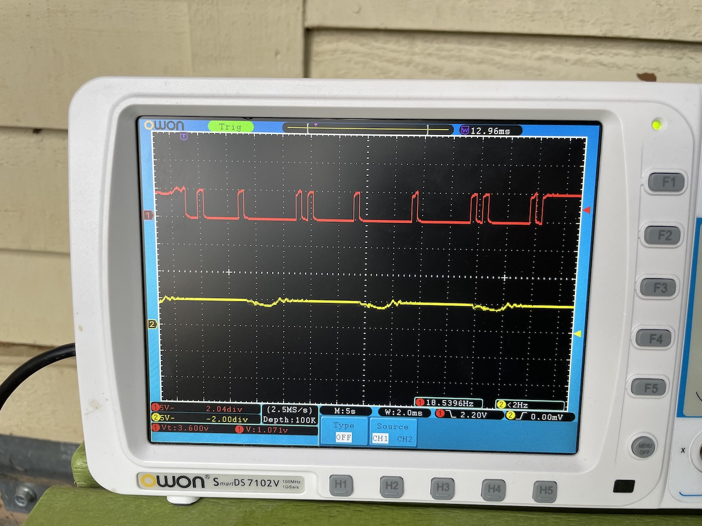

# Reverse engineering

For general interest, this is a rough description of the process I went through to reverse-engineer the panel protocol.

When I started this project, I had a Softub that was nominally working (although it was having some issues -- sometimes the display would flicker randomly, other times it would fail to run at all, or run in short bursts repeatedly), and some spare parts: an additional control panel/display (which was cosmetically in pretty rough shape, but fully functional), temperature sensors (uncertain of their accuracy), and a mostly-dead control board.

In the process of trying to figure out whether I could repair the mostly-dead control board, I found that it was drawing too much power from the 5v/1A regulator on the board, causing it to brown out or shut down completely. I desoldered the regulator and hooked my current-limiting bench power supply to the board to try and locate the short. In the process, I fed it a bit more current, and determined that the draw must be going through one of the microcontroller's pins. 

By letting the smoke out of it. 

Oops.

At this point, I decided to try and build a full replacement. The challenge I set for myself was to make it use the original display/button pad. To make this work, I needed to figure out how the controller talked to the pad. The connection between the two was only 5 wires, which wasn't enough for a dumb key/led matrix; there had to be some sort of protocol involved. I could also see that there was another microcontroller potted in clear epoxy as part of the panel, so it seemed likely that it was something custom.

## Input

As part of my previous troubleshooting, I had de-soldered the 5V regulator from the board, and I was able to use a multimeter on the dead control board (by checking continuity between the 5V regulator output pads and the connector pins) to determine that two of the wires going to the panel were just +5v and ground. I hooked up the spare panel to power and ground accordingly, and checked the other three wires with my oscilloscope. One of them (the red wire) had a digital signal on it. It was +5V most of the time, with short pulses to 0V. 

*Spoiler alert: at the time, I wasn't too familiar with what a TTL Serial signal looked like. I now know that it looks just like this.*

I was able to press buttons on the panel and see the pulses in the signal change; this told me that it was probably what I was looking for. 

I wrote some Arduino code to rather laboriously track the negative/positive pulses via interrupts configured on a pin, calculate the timing, and turn them into ones and zeroes. Using the measurement tools on the scope I found that the bit pulse duration was 0.416 milliseconds (or 416 microseconds). (The measurement box near the lower left of the display shows the time bewteen the two purple cursor lines as "∆x".)

Somewhere around this time I realized that the bit patterns I was seeing (an initial low pulse, 8 high/low pulses, and back to high at the end) was exactly what TTL serial with one start bit and no parity looked like. A bit clock of 416 microseconds is approximately 1/2400 of a second, which meant I was looking at serial data at 2400 baud/8-N-1. I switched to using Arduino's Serial1 with these settings and threw out my janky code.

Once I had the Arduino code receiving the data, I had it log the received bytes over its own USB Serial interface and pressed buttons again. The panel was sending a single byte 3 times per second. The byte varied with which buttons were pressed:

- None: 0x0F = 00001111
- Jets: 0x1E = 00011110
- Light: 0x2D = 00101101
- Up: 0x4B = 01001011
- Down: 0x87 = 10000111

Looking at this pattern, you can see that each button turns on one bit in the high nybble, and turns off the same bit in the low nybble. This makes a sort of built-in checksum: if you negate one of the two nybbles it should equal the other. This is important because it's very easy for serial data like this to get corrupted, and you don't want false button presses getting received.

Holding down multiple buttons follows the same pattern, so the one-byte report tells you the state of all 4 buttons at once.

With this, the code to read the panel buttons was basically done. Now I had to figure out how to write to the display. 

## Output

The display has three seven-segment digits and two LEDs labelled "Heat" and "Filter".

As I mentioned, I had finished off my spare control board, so I couldn't look at its output to the panel. Since I didn't want to disassemble my working hot tub at this point, I put together a tap with a small breadboard, some right-angle pin headers, and some male-to-female jumper wires. With this plugged in beween the control board and the connector on the running hot tub (careful of the 120vAC wires on the other end of the board!), I had an easy way to get the oscilloscope probes connected to the wires. I took my oscilloscope out to the yard...

This allowed me to capture some traces of the protocol in the other direction. It looked familiar, with the same polarity, bit clock, and format. Just more bytes. 7 of them, to be exact.

I took a number of photos of both the oscilloscope screen and the panel display with them in different states, then went back inside and did a bunch of hand-decoding of bit patterns.

(In retrospect, it probably would have been easier to write some code on the Arduino read bytes from the serial line and spit out their values. I'll probably do that next time.)

Looking at the bit patterns and how they change told me a few things. 

Bytes 0 and 6 always seem to be 0x02 and 0xFF, respectively. (I assume this is just framing, or possibly a protocol version, but it doesn't really matter -- I just have my code do the same.) 

Bytes 2, 3, and 4 map directly to the three digits of the temperature display -- values 0x00 through 0x09 show the digit directly, and through experimental code I determined that 0x0A makes the digit blank, and 0x0B displays a letter 'P'. 0x0C displays some weird character I couldn't identify, and higher values seem to crash the microcontroller in the panel (it would stop sending button reports after receiving a message with other values), so I stopped there.

I could also determine from the sample bit patterns that byte 5 is some sort of checksum (every time one of the other bytes change, it also changes). The first thing I tried (just adding the values of bytes 1 through 4 into an 8 bit unsigned value and allowing it to overflow) turned out to be correct, and the panel would accept and display the data.

I didn't manage to capture any data with the "Heat" or "Filter" lights lit up, but the fact that byte 1 wasn't doing anything was mighty suspicious. I tried having my test code set various bits in that byte, and quickly found that setting the 0x10 bit lights up the "Filter" light and the 0x20 bit lights up "Heat".

That's pretty much it for the reverse-engineering part of the project. The code incoroprates the knowledge of the protocol -- see the read_buttons() function for the receive side and the various display_*() functions (especially display_set_digit() and display_update_checksum()) for the send side.

